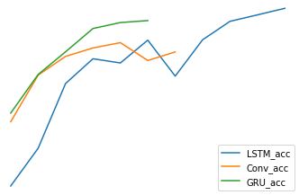
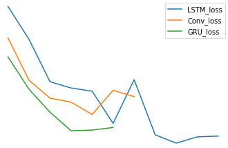
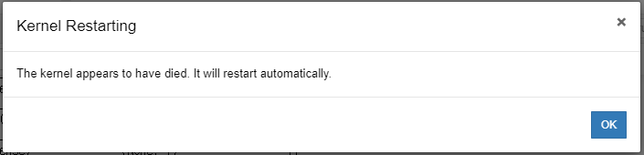

# aiffel_E06
Exploration_6, Classify NSMC (Naver sentiment movie corpus) using Con1d, LSTM, and GRU.  
Con1d, LSTM, GRU모델을 이용해 NSMC (Naver sentiment movie corpus) 데이터셋 분류하기.
[NSMC](https://github.com/e9t/nsmc).
  
  
## 개요
- 네이버 현재 상영작 평점 가져오기.    
    본 시스템은 크게 3가지 단계로 이루어져 있습니다.
    1. Get the latest Naver sentiment movie corpus  
        - 네이버 현재 상영작 평점 링크로 이동합니다.
    2. page수 받기  
        -총 평점 갯수에서 한 페이지에 나오는 최대 평점을 나눕니다.  
    3. 평점받고 csv파일로 저장하기.  

- Con1d, LSTM, GRU를 통해 training, validation    
    본 시스템은 크게 4가지 단계로 이루어져 있습니다.
    1. Data pre-processing  
        - /data에 있는 데이터(train, test)를 가져옵니다.
        - 중복제거
        - Null 값 제거
        - 토큰화
        - 불용어 제거
        - 최대 문장 길이 지정
        - 패딩 추가
    2. learning  
        -Con1d, LSTM, GRU model학습  
        -validation loss, acc확인  
    3. Data pre-processing 2  
        -ko Word2Vec임베딩을 통해 pre processing  
    4. learning  
        -Con1d, LSTM, GRU model학습
        -2번과 validation loss, acc비교   


## Installation
파이썬 개발 환경으로 최신 버전의 Anaconda를 설치하세요. (Python3 버전용)
* numpy
* pandas
* konlpy
* gensim==3.8.0
* matplotlib

```
$ pip install -r requirements.txt
```

------------
## Directory
필수 디렉토리는 다음과 같습니다
```
.
├── data/
│   ├── ko.bin
│   ├── ratings_test.txt
│   ├── ratings_train.txt
│   └── word2vec.txt
├── [E06]sentiment_classification.ipynb
└── get_new_nsmc.py
```

------------
### acc(no Word2Vec)
    

    
------------
### acc(no Word2Vec)
    

    
------------
### result
    

    
------------
### acc
    

    
------------
### loss
    

    
------------
## 느낀점
1. LMS예제와 달리 순수 한글과 띄어쓰기만 넣어도 acc가 좋았습니다.  
2. word2vec를 통한 GRU를 돌릴 때 계속 kernel이 죽음  
    -batch size의 max인 2000까지 넣었습니다.
        -그래도 kernel이 죽음  
    -그래도 validation acc를 85%까진 올렸습니다.  
3. 실제로 크롤링을 통해 실시간 네이버 영화평을 가져올려고 했으나 1000개의 댓글이 지나면서 에러가 발생했습니다.  
    -이유 불명  

------------
## Reference
1. [NSMC WikiDocs](https://wikidocs.net/44249)
2. [TF2-NSMC_ryuseonghan](https://github.com/ryuseonghan/TF2-Study/blob/master/naver_sentiment_movie_rnn.ipynb)